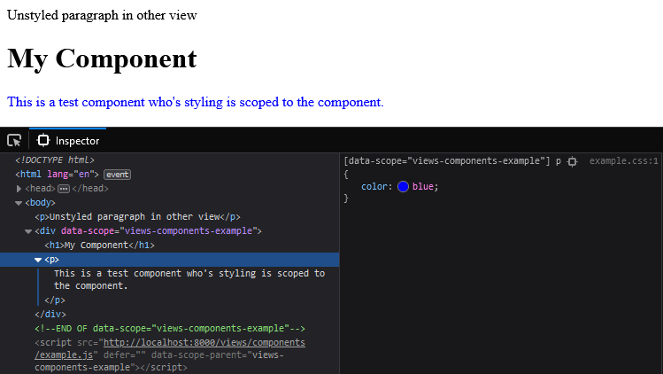

# ⚠ Abandoned | Laravel Scoped Views

[](https://github.com/luttje/laravel-scoped-views/blob/main/LICENSE) 

> **Warning**
> This package is no longer maintained. You should use a front-end framework or build your own variant of this package. 
> Perhaps [this PR](https://github.com/luttje/laravel-scoped-views/pull/1) and [this package](https://github.com/luttje/laravel-scoped-components) will be of use to you.

<hr>

> 📛 **Scope view/component styles by pre-processing (s)css files.** Meaning that styles belonging to a view/component won't leak out into the rest of the page.

> 🤖 **How?** When Laravel Mix is run (`npm run dev`/`watch`/`prod`) a unique attribute is prefixed to each selector. The same attribute is added to the component:
> 
> 

> 🔨 **All features**
> - Compile CSS and Sass belonging to views to separate files in your public directory.
> - Automatically include those files when their view needs them.
> - Easily inline style rules by annotating them with CSS comments.

## Basic Usage

1. Create a blade view (`x.blade.php`), with accompanying script (`x.js`) and style files (`x.css` OR `x.scss`) of the same name:
    ```html
    <!-- resources/views/components/example.blade.php -->
    <x-scoped>
        <p>
            Paragraphs in this component are blue.
        </p>
    </x-scoped>
    ```
    ```scss
    // resources/views/components/example.scss
    p {
        color: blue;

        span {
            font-weight: bold;
        }
    }
    ```
    ```js
    // resources/views/components/example.js
    console.log('hello world!');
    ```
2. Add `@stack('scoped-scripts')` and `@stack('scoped-styles')` to your layout to mark where scoped scripts and styles (respectively) are to be placed:
    ```html
    <!-- resources/views/layouts/app.blade.php -->
    <!DOCTYPE html>
    <html lang="en">
    <head>
        <!-- Links will be placed here -->
        @stack('scoped-styles')
    </head>
    <body>
        @yield('content')

        <!-- Scripts will be placed here -->
        @stack('scoped-scripts')
    </body>
    </html>
    ```
3. Modify `webpack.mix.js` to include a call to `mix.scoped()`:
    ```js
    // webpack.mix.js
    const mix = require('laravel-mix');
    require('laravel-scoped-views');

    mix.scoped({
        // @see README#configuration for more options
        includeSass: true,
    });
    ```
4. Run `npm run dev` (or `watch` or `prod`).

With this last step all `.js`, `.css` (or `.scss`) with the same names as views will be compiled to the `public/views` directory.

Blade views will check for the existence of these script and style files and include them automatically (once). This check happens when blade views are compiled the first time. Meaning the result is cached.


## Configuration

### Configuring Laravel Mix
The `mix.scoped()` function accepts a single object with configuration options:
```js
mix.scoped({
    // Directory paths (defaults will work for 99% of Laravel installations)
    paths: {
        base: null, // Defaults to root of Laravel project
        views: 'resources/views',
        compiledViews: 'storage/app/scoped-views',
    },

    // Whether to automatically run `php artisan view:clear` after compilation
    clearViewCache: true,

    // Should Sass be compiled? (Enabling this will automatically install dependencies the first time Mix runs)
    includeSass: false,

    // Contains an array extensions to handle for each view. Check `src/js/handlers` for the defaults (js, css, scss).
    handlers: {
        text: [
            // If a file in resources matches this regex, the function will be called
            /.txt$/,
            // Function to be called. Should instruct Laravel Mix.
            (resourcePath, publicPath, uniqueName, mix, plugin) => {
                mix.copy(resourcePath, publicPath);
            }
        ],
    }
});
```
*If you do not specify an option, the defaults will be used. See [src/js/index.js](src/js/index.js) for the default configurations.*


### Configuring the Service Provider
You can configure css and js deferring, and the names of the stacks in `config/scopedblade.php`. 
Run `php artisan vendor:publish --provider="Luttje\ScopedViews\ServiceProvider"` to publish that config file to your project.


## Magic Style Annotations

The npm package has some additional features that can be activated by adding comments to a file or specific style rule. 

**All annotations must be a valid JSON object ([validate here](https://jsonlint.com/)).** Annotations can be combined by placing them in in the same object. E.g:
```css
/* { "global": true, "inline": true } */
.do-not-scope-but-do-inline-in-page {
    color: red;
}
```

### Global layout style
A layout view is treated exactly as a normal view. This means you can accompany a layout with `.js` and `.css` (or `.scss`) of the same name. However you likely don't want to scope the css to just your layout. Disable scoping by placing `/* { "allGlobal": true } */` on the first line of the css file. 


### Specifically global rules
You shouldn't want component rules to leak out into the global page style. But if for whatever reason you do want this, you can add `/* { "global": true } */` above a single rule to make it global. 


### Inlining a rule
With this package you can also choose to inline certain rules into the HTML of the page. To do that you can add either `/* { "allInline": true } */` at the top of the file OR `/* { "inline": true } */` to a specific rule. These rules will be compiled to a seperate file (`<filename>.inline.css`) and injected into the page when Blade compiles its views. 

**Note: Because the styles are injected on Blade View compilation, you will have to clear the view cache on changes to your style!** (`php artisan view:clear`)


## Notes

### Clear your cache
- **You have to clear your view cache if you add .js and .css files**
By default running `npm run dev` will automatically clear view cache. If you disable this configuration (`mix.scoped({ clearViewCache: false }`) you have to run `php artisan view:clear` manually.


### Javascript scope
Javascript files are simply automatically included on the page (once) when the view they belong to is used. They are not scoped or sandboxed.

Use the script tag's `data-scope-parent` attribute if you want to get the scoped HTML element that belongs with your script.
```js
var myScopeAttribute = document.currentScript.getAttribute('data-scope-parent');
var myScopedElement = document.querySelector(`[data-scope="${myScopeAttribute}"]`);
console.log(myScopedElement);
```


## Contributing

1. `composer install`
2. `npm install`
3. `./vendor/bin/dusk-updater detect --auto-update`
4. Execute the tests with `./vendor/bin/phpunit`
